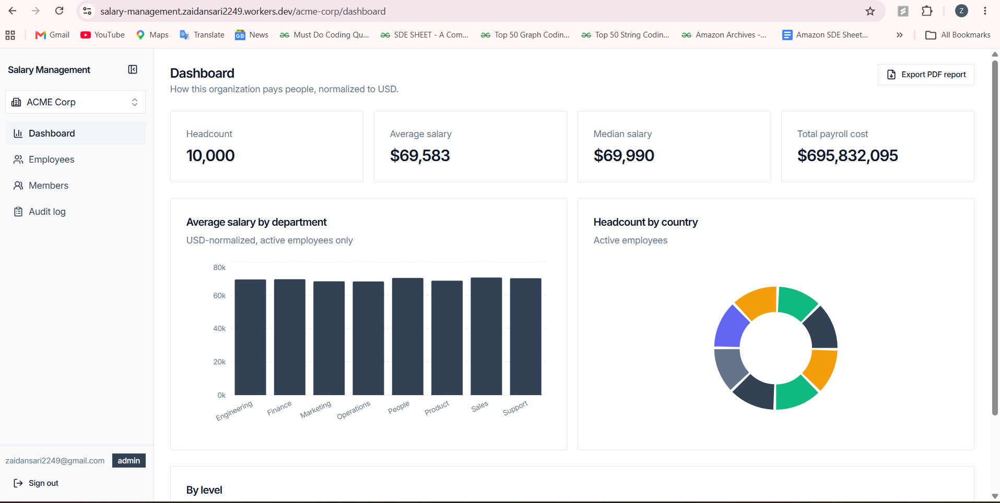

# Salary Management

Multi-tenant salary management for HR teams: employee records, append-only
salary history across currencies, CSV bulk import/export, live analytics, and
a full audit trail — with organizations, roles, and invitations built on our
own tables rather than an auth provider's org primitive.

**Live app:** https://salary-management.zaidansari2249.workers.dev
**API:** https://salary-management-api.zaidansari2249.workers.dev
**Repository:** https://github.com/zaid225/salary-management
**Demo video:** https://www.loom.com/share/9daddd06edc94d5fb48e6397f7083b94



Design spec: [`docs/superpowers/specs/2026-08-26-salary-management-design.md`](docs/superpowers/specs/2026-08-26-salary-management-design.md)

## Tech stack

| Layer | Choice | Why |
|---|---|---|
| API | **Hono** on **Cloudflare Workers** | Hono is a few kilobytes and has no Node-runtime assumptions, so it runs directly on the V8 isolates Workers use. The API starts in ~40 ms at the edge instead of cold-starting a container, which is what makes a per-request DB connection affordable. |
| Database | Postgres (Supabase) via **Hyperdrive** + **Drizzle ORM** | Workers cannot hold a TCP pool across requests; Hyperdrive pools on Cloudflare's side so each isolate opens a cheap connection. Drizzle emits plain SQL with no runtime reflection, which keeps the bundle small enough for an isolate. |
| Frontend | **React 19** + Vite + Tailwind v4 + Radix (shadcn-style) | Deployed as a static-asset Worker on the same edge network. |
| Data layer | **TanStack Query** + **TanStack Virtual** | Server state and cache invalidation; virtualization so a 1,000-row page mounts only what is visible. |
| Auth | **Clerk** (headless) | Identity only. Sign-in, sign-up and profile are our own UI on Clerk's hooks — no hosted components. |
| Rate limiting | **Upstash Redis** | Sliding window on the two endpoints that cost real work: invitations and CSV import. |
| Email | **Postmark** | The one transactional message this product sends: the invite link. |

## Architecture

```
hono-worker/   Hono API on Cloudflare Workers
               Postgres (Supabase) via Hyperdrive + Drizzle ORM, Clerk auth
frontend/      React 19 + Vite + Tailwind v4 + shadcn-style UI
               Deployed as a static-asset Worker, calls the API with a Clerk token
```

Two things shape most of the design:

**Tenant isolation is structural, not per-handler discipline.** `resolveOrg`
middleware is the only place an organization is authorized — it verifies an
active `memberships` row and puts `orgId`/`orgRole` on the request context.
Org ids are never trusted from a body, query, or param. Domain queries go
through a `scopedDb(db, orgId)` helper that pre-applies the `organization_id`
filter, so a route can't forget it.

**Salary is history, not a column.** A raise inserts a new `salary_records`
row; nothing is ever overwritten. "Current salary" is the latest row per
employee by `effective_date` (`DISTINCT ON`), which makes "what did this
person earn in 2024" answerable for free. Deletes are soft throughout —
employees are terminated, members removed, invitations revoked — so history
and the audit trail survive.

## Running it

Requires Node 20+, a Postgres database, and a Clerk application.

```bash
# API
cd hono-worker
npm install
cp .env.example .env          # fill in DATABASE_URL, CLERK_SECRET_KEY, ...
npm run db:push               # apply the schema
npm run dev                   # wrangler dev, on :8787

# Frontend, in a second terminal
cd frontend
npm install
cp .env.example .env          # VITE_CLERK_PUBLISHABLE_KEY, VITE_API_URL
npm run dev                   # vite, on :5173
```

Seed two organizations (ACME with 10,000 employees, Globex with 25) so tenant
isolation is visible rather than just claimed:

```bash
cd hono-worker
DATABASE_URL=... SEED_ADMIN_CLERK_USER_ID=<your clerk user id> npm run seed
```

The generator is deterministic (seeded PRNG), so re-running produces the same
dataset.

### Clerk setup

Three steps that can't be scripted, done once in the Clerk dashboard:

1. Enable the **Google** social connection.
2. Register `POST /webhooks/clerk` as a webhook endpoint and copy its signing
   secret into `CLERK_WEBHOOK_SECRET`. This keeps the local `users` mirror in
   sync so member lists and audit entries can show a name without calling
   Clerk's API on every render.
3. Add your origins (including `localhost`) to the allowed redirect URLs so
   `/sso-callback` resolves.

Clerk provides identity only. Sign-in and sign-up are our own UI built on its
headless hooks — no hosted `<SignIn/>`/`<SignUp/>` components anywhere.

## API

All routes are under `/api`, zod-validated, paginated (`limit`/`offset`,
default 25; max 100, or 1000 on `/employees` — over-max is clamped, not
rejected), and return errors as
`{ error: { message, statusCode } }`.

Everything except `/webhooks/clerk` and the org-management routes runs behind
`requireAuth` + `resolveOrg`, with writes additionally behind
`requireRole("admin")`.

| Method | Path | Auth | Purpose |
|---|---|---|---|
| POST | `/webhooks/clerk` | Svix signature | Upsert the local `users` mirror |
| POST | `/organizations` | auth | Create an org; creator becomes its first admin |
| GET | `/organizations` | auth | Orgs the caller belongs to |
| GET | `/organizations/:orgId/members` | member | List members |
| PATCH | `/organizations/:orgId/members/:id` | admin | Change a member's role |
| DELETE | `/organizations/:orgId/members/:id` | admin | Soft-remove a member |
| GET | `/organizations/:orgId/invitations` | member | Pending invitations |
| POST | `/organizations/:orgId/invitations` | admin | Invite by email (idempotent) |
| DELETE | `/organizations/:orgId/invitations/:id` | admin | Revoke a pending invite |
| POST | `/invitations/:token/accept` | auth | Redeem an invite |
| GET | `/employees` | member | Filterable, paginated roster |
| GET | `/employees/:id` | member | Profile + full salary history |
| POST | `/employees` | admin | Create employee + initial salary |
| PUT | `/employees/:id` | admin | Update profile fields |
| DELETE | `/employees/:id` | admin | Soft-delete (terminate) |
| POST | `/employees/:id/salary` | admin | Append a salary record |
| POST | `/employees/import` | admin | CSV bulk upsert, per-row error report |
| GET | `/employees/export` | member | CSV of the current filtered view |
| GET | `/analytics/summary` | member | Headcount/avg/median/total USD by country, department, level |
| GET | `/audit-log` | member | Paginated, filterable by entity |
| GET | `/employees/facets` | member | Distinct departments/countries/levels + convertible currencies, for the form dropdowns |
| POST | `/employees/bulk-delete` | admin | Queue a bulk termination; returns `202` with a job |
| GET | `/jobs` · `/jobs/:id` | member | Job list, and one job with its logs |
| POST | `/jobs/:id/advance` | admin | Process the next chunk of a job |
| POST | `/jobs/:id/cancel` | admin | Stop further chunks |
| POST | `/jobs/:id/run` | run token | Same runner for an unattended driver (queue callback) |

A few behaviors worth knowing before poking at it:

- **Inviting the same address twice** re-shares the existing link and sends no
  second email, rather than 409ing.
- **An org can never lose its last admin** — demoting or removing them is
  refused with a 409.
- **CSV import updates profiles only.** Re-importing a roster never silently
  changes anyone's pay; that goes through `POST /employees/:id/salary`.
  Failures are reported per row, and a bad row does not abort its batch (each
  row runs in its own savepoint).
- **Analytics excludes employees whose currency has no FX rate** rather than
  erroring, so one unrecognized currency can't blank the dashboard.

## Scaling

Four things carry the load, in the order they start to matter.

**Every list is bounded and indexed.** No endpoint returns an unbounded set.
Filters run in Postgres against `organization_id`-leading composite indexes,
so narrowing by country or department is an index range scan rather than a
sequential one. Sorting is server-side against an explicit column allowlist,
with an id tiebreak so rows never shuffle between pages.

**Writes are batched, not looped.** CSV import was originally four queries per
row — about 800 round trips for a 200-row file. It now does one existence
prefetch, one multi-row upsert, one bulk salary insert and one bulk audit
insert per batch: four queries regardless of batch size. Measured: 250 rows in
~2.9 s against a remote database. A batch is split into "waves" so no wave
repeats an employee number, because a multi-row upsert cannot touch the same
conflict target twice.

**Long work is a row, not a request.** A bulk termination over thousands of
employees cannot finish inside one Worker invocation, and a browser tab is not
a durable place to keep progress. `POST /employees/bulk-delete` returns `202`
with a `jobs` row; the runner processes 500 rows per call, walking forward from
a stored cursor inside a transaction that also writes the audit entries. Closing
the tab loses nothing that has committed — reopening re-attaches to the same job
at the same point. Re-running after a crash redoes at most one chunk and never
double-counts, which is what makes the runner safe for a queue to retry.

**The edge does the rest.** Workers scale horizontally per isolate with no pool
to exhaust; Hyperdrive keeps the Postgres connection count flat no matter how
many isolates are live. Upstash Redis sliding-window limits guard the two
endpoints that cost real work (invitations, CSV import).

### Where it would go next

- `POST /jobs/:id/run` already accepts a per-job run token, so an external
  queue (QStash or Cloudflare Queues) can drive jobs with no user session and
  retry safely. Wiring that up is a credentials change, not a redesign.
- Analytics is live SQL over an indexed table — single-digit milliseconds at
  10k rows, ~400 ms measured across the network. Past a few hundred thousand
  employees per org, a materialized rollup refreshed on write becomes worth its
  staleness.
- Read replicas would be the next step after that; every analytics and list
  query is already read-only and org-scoped, so routing them is mechanical.

## Validation

One zod schema per resource lives in `hono-worker/src/schemas/` and is
imported directly by the frontend through the `@shared` alias. The API, the
CSV importer, and the React forms all validate against the same object, so a
rule like "employee number matches `^[A-Z]{2,4}-\d{4,6}$`" is written once and
cannot drift. The server re-validates regardless of what the client does —
that's the actual security boundary.

## Testing

```bash
cd hono-worker && npm test     # ~130 tests
cd frontend && npm test        # component tests, jsdom
```

Two kinds of backend test. The fast ones are pure — schemas and the
deterministic data generator, no database, no clock, ~1 s for 36 of them. The
rest run against a real Postgres (set `TEST_DATABASE_URL` in `.env.test`)
rather than mocks, covering auth gating, validation, soft deletes,
transactional audit writes, the full invite lifecycle, job chunking and resume,
and the case that matters most in a multi-tenant system: a member of org A
getting a 403 rather than org B's data when calling org B's endpoints with a
valid session.

**`TEST_DATABASE_URL` must point at its own database.** Every test file
`TRUNCATE`s the schema in `beforeEach`, so pointing it at the production
database destroys real data. The harness refuses to run when the two URLs
resolve to the same database.

## Deployment

```bash
cd hono-worker && npx wrangler deploy    # bind HYPERDRIVE, set secrets
cd frontend && npm run build             # dist/ → Cloudflare Pages
```

Every env var is optional and degrades rather than crashing boot: no Postmark
token means invites still work and the admin shares the link manually; no
Upstash means rate limiting is a no-op; no database means a clean 503 instead
of a stack trace.

| Var | Used by |
|---|---|
| `HYPERDRIVE` binding / `DATABASE_URL` | Worker / migrations + seed |
| `CLERK_SECRET_KEY` | Session verification |
| `CLERK_WEBHOOK_SECRET` | Svix signature check |
| `FRONTEND_URL` | CORS allow-list origin |
| `UPSTASH_REDIS_REST_URL` / `_TOKEN` | Rate limiting invites and CSV import |
| `POSTMARK_SERVER_TOKEN` | Invite emails |
| `SEED_ADMIN_CLERK_USER_ID` | `npm run seed` only |
| `VITE_CLERK_PUBLISHABLE_KEY`, `VITE_API_URL` | Frontend build |

## Repo layout

```
hono-worker/
  src/
    routes/        route definitions, one file per resource
    controllers/   handlers + auth/rate-limit/error middleware
    models/        Drizzle schema, scopedDb, audit helper
    schemas/       zod schemas (shared with the frontend)
    lib/           env, logger, Postmark, validators
  scripts/         seed + deterministic employee generator
  drizzle/         generated migrations
frontend/
  src/
    pages/         one file per route
    components/    app shell, dialogs, ui/ primitives
    hooks/         TanStack Query hooks, one per endpoint
    lib/           api client, org context, types
docs/superpowers/  design spec and implementation plans
```
